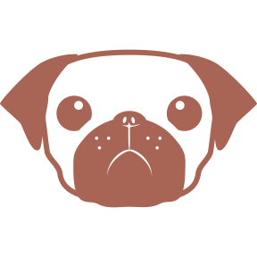
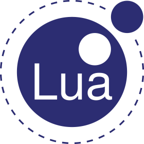
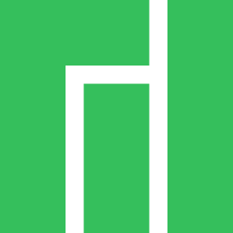
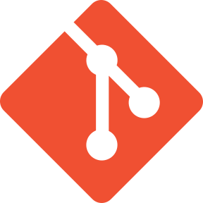
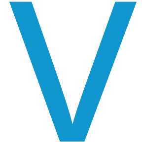

# **hi, i'm aemx.**
***i typically go by CERiNG or cerhythm on most platforms.***

## **current projects**
- creating and maintaing websites and webservers (html/pug + css/stylus + js + more...) 
- creating story-driven content for [NotITG](https://notitg.heysora.net/) (lua + node.js)
- designing charts for [lowiro's](https://lowiro.com) flagship rhythm game, [Arcaea](https://arcaea.lowiro.com) (level design)
  
## **languages**

## **tools/services**

## **contact me**

