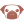

# **hi, i'm ceri!**
***you'll typically see me go by "CERiNG" on other platforms.***

## **frameworks**

## **scripting/programing languages**

## **markup/stylesheet languages**

## **tools/services**

## **operating systems**

## **contact me**

